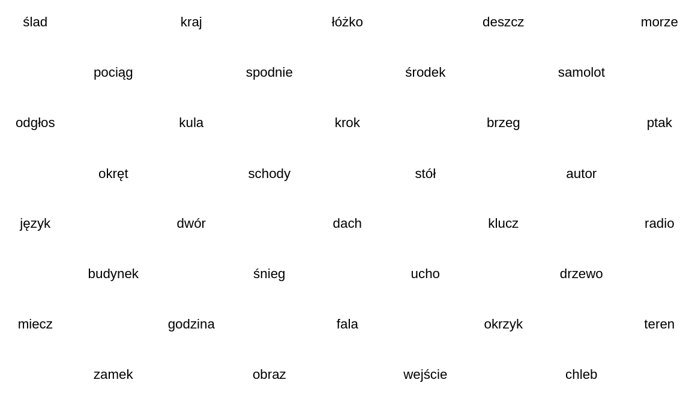
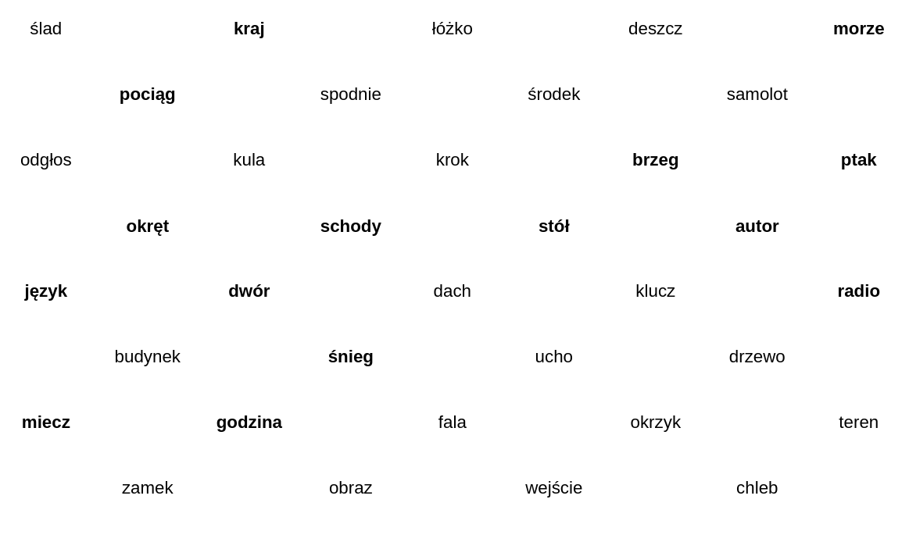

# Badanie psychologiczne
Badanie eksperymentalne z zakresu psychologii poznawczej, sprawdzające wpływ pogrubionej czcionki na zapamiętywanie słów z arkusza.

## Hipoteza badawcza
Pogrubienie słów na kartce zwiększa szansę na ich zapamiętanie.

## Uczestnicy badania
Zbadano 54 ochotników, wśród nich: 26 kobiet i 28 mężczyzn. 41 osób między 18. a 22. rokiem życia (włącznie), 4 osoby między 23. a 27. rokiem życia (włącznie), 2 osoby między 28. a 32. rokiem życia (włącznie) oraz 7 osób w wieku 43 lat lub starszych. 14 osób tylko pracujących, 28 osób tylko studiujących, 12 osób studiujących i pracujących.

## Proceedura badawcza
Słowa zostały wybrane spośród 1000 najpopularniejszych słów Jerzego Kazojcia. Wybrano 50 słów, wyłącznie rzeczowników w liczbie pojedynczej. Wybrano słowa, które nie powinny budzić skrajnych emocji wśród osób badanych. Arkusze zawierały 50 słów, układ będzie widoczny na załączonych arkuszach. Ułożonych zostało 6 wersji arkusza, odpowiednio po 3 na grupę eksperymentalną i kontrolną. Arkusze różniły się ułożeniem słów - pogrubione wyrazy zawsze były takie same (słowa "wyróżnione"). Zmieniało się jedynie ich położenie na kartce. Badanie było przeprowadzane w różnym miejscu i różnym czasie, spotykając się indywidualnie z osobami badanymi w czasie dla nich dogodnym. Dobór grupy eksperymentalnej i kontrolnej był losowy.

## Podział grup
### Grupa kontrolna - arkusz bez pogrubionych słów

### Grupa eksperymentalna - arkusz z pogrubionymi słowami

## Wyniki
### Analiza opisowa
|                           | Liczebność | Zakres | Minimum | Maksimum | Średnia | Odchylenie standardowe | Wariancja |
|---------------------------|------------|--------|---------|----------|---------|------------------------|-----------|
| Odsetek wypisanych słów "wyróżnionych"                   | 54         | 1      | 0       | 1        | 0.5408  | 0.23035                  | 0.053     |
| Odsetek wypisanych słów "wyróżnionych", gdy ich czcionka nie była pogrubiona (grupa kontrolna) | 27         | 0.83   | 0.17    | 1        | 0.5173  | 0.21327                  | 0.045     |
| Odsetek wypisanych słów "wyróżnionych", gdy ich czcionka była pogrubiona (grupa eksperymentalna) | 27         | 1      | 0       | 1        | 0.5643  | 0.24805                  | 0.062     |
### Analiza statystyczna
|                         | t       | df    | Sig. (2-tailed) | Mean Difference | Std. Error Difference | 90% Confidence Interval of the Difference |
|-------------------------|---------|-------|-----------------|-----------------|-----------------------|------------------------------------------|
| Odsetek wypisanych słów "wyróżnionych" | -0.748 | 50.857 | 0.458           | -0.04706          | 0.06296                 | Lower: -0.15254, Upper: 0.05841           |

| Odsetek wypisanych słów wyróżnionych | Pearson Correlation | Sig. (1-tailed) | N  |
|--------------------------------------|---------------------|-----------------|----|
| Czy czcionka "wyróżnionych" słów była pogrubiona (0-nie, 1-tak) | 0.103               | 0.229            | 54 |

Przy przyjętym poziomie istotności statystycznej 5%, oba testy nie dają podstaw do uznania hipotezy badawczej.
